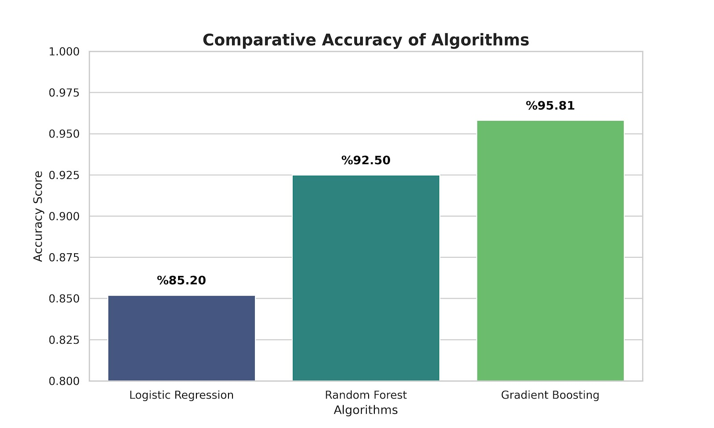

# Alzheimer's Disease Early Detection Project 🧠

This project focuses on the early detection of Alzheimer's Disease using Machine Learning algorithms. We analyzed clinical and demographic data from 2,149 patients to predict disease presence using Python.

## 🏆 Key Results
Our comparative analysis shows that **Gradient Boosting** is the most effective model for this task.

| Model | Accuracy |
|-------|----------|
| **Gradient Boosting** | **95.81%** 🚀 |
| Random Forest | 92.50% |
| Logistic Regression | 85.20% |

## 📂 Project Structure
- **`Alzheimer_Detection_Analysis.ipynb`**: The main Python notebook containing data preprocessing, EDA, model training, and evaluation.
- **`Alzheimer_disease_project_report.pdf`**: Detailed academic report of the project.
- **`alzheimers_disease_data.csv`**: The dataset used for training and testing.

## 🛠️ Technologies Used
- **Language:** Python
- **Libraries:** Pandas, Scikit-learn, Seaborn, Matplotlib

## 📊 Key Findings
- **Functional Assessment** and **ADL (Activities of Daily Living)** scores were identified as the most critical features for diagnosis.
- Ensemble methods (Gradient Boosting & Random Forest) significantly outperformed linear models.

## 👥 Contributors
- Aleyna CEYLAN
- Huseyin FIDAN
